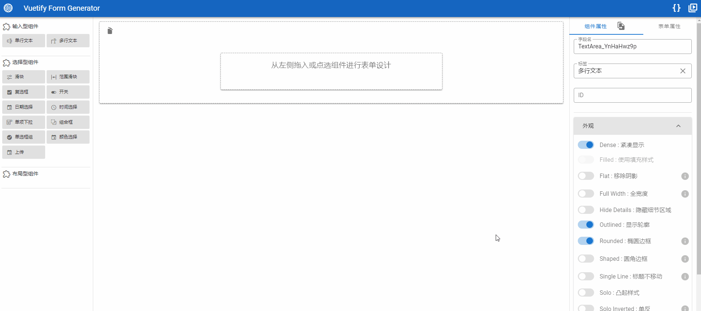
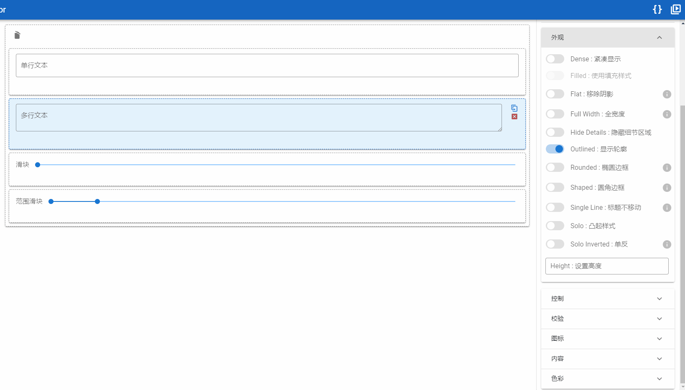
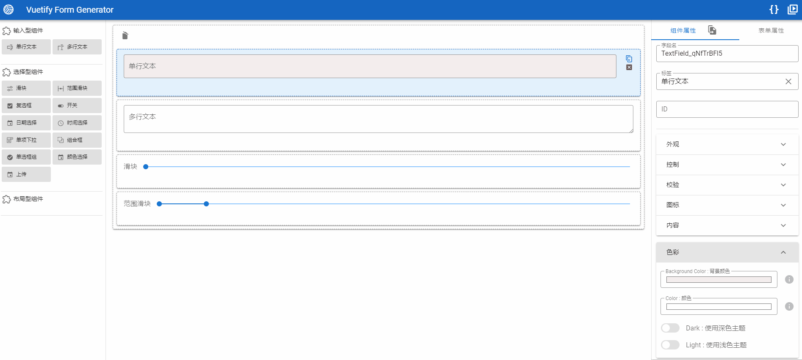

中文 &nbsp; | &nbsp; [English](./README_EN.md)

<p align="center"></p>
<h1 align="center"> Vuetify Form Generator &nbsp;🚀 &nbsp;表单设计器&代码生成器 </h1>
<h3 align="center">基于JSON Schema，全组件化工程，所见即所得</h3>

---

<p align="center">
    <a href="https://vuetifyjs.com/zh-Hans/" target="_blank"></a>
    <a href="https://cn.vuejs.org/"></a>
    <a href="./LICENSE"></a>
    <a href="https://gitee.com/herodotus/vuetify-form-generator"></a>
    <a href="https://gitee.com/herodotus/vuetify-form-generator"></a>
</p>

<p align="center">
    <a href="https://github.com/Pointerv/vuetify-form-generator">Github 仓库</a> &nbsp; | &nbsp; 
    <a href="https://gitee.com/herodotus/vuetify-form-generator">Gitee 仓库</a> &nbsp; | &nbsp; 
    <a href="http://herodotus.gitee.io/vuetify-form-generator" target="_blank">在线体验</a>
</p>


## 注意

> 由于升级了 Husky 版本，如在 yarn push 或者 git push 操作中遇到 **error Command "husky-run" not found** 报错无法提交的情况，请删除工程目录中 .git/hooks 目录，再次 push 即可解决问题

> 已升级lerna 至 4.0.0, 使用前记得全局升级lerna。`yarn global upgrade-interactive --latest`

## 预览

### 1. 总览



### 2. ICON 和 COLOR 设置展示



### 3. RULE 设置展示



## 简介

在做工作流服务时，深感动态表单的重要性。所以，慢慢摸索和学习，结合自己的需求，搭建了本套动态表单系统。

- 本系统是基于 lerna 和 yarn workspaces 构建的， monorepo 方式管理代码的项目（很喜欢这种方式，和 Maven 的模块化工程一样，最主要是不用每个项目一堆 node_modules）
- 基于 Vue 2.0 和 Vuetify 2.3.XX 构建。没有使用 Vue3，主要是 Vuetify 3 还在开发中。
- 共性组件采用 rollup 进行编译，并且做了已有认知范围内，能够做到的所有性能优化处理
- example 模块，基于 vue webpack 方式，对工程打包进行了深入优化。
- 项目中会有很多组件，是把以往工作中涉及的通用性的东西，逐步提取构建出一个组件库（动态表单系统本身也是一个组件）。
- 基于 VeeValidate 表单校验，通过属性面板进行动态配置。
- 表单设计器，高度组件化设计，通过修改配置和增加组件即可完成扩展。
- 浏览器本地存储采用 localForage，支持 IndexedDB，WebSQL 和 localStorage 三种存储模式

本项目是后端老炮撸的前端，广度和深度肯定不如纯前端，不喜勿喷，也请多多包涵以及多多交流，互相促进互相成长。

## 在线体验

- [[国内Gitee地址]](http://herodotus.gitee.io/vuetify-form-generator)

## 趋势图

[](https://whnb.wang/herodotus/vuetify-form-generator)

## [一]、开发环境配置（Windows）

开发环境的配置以及相关组件环境变量的配置，比较常规。如果有需要，参见文档：

[https://blog.csdn.net/Pointer_v/article/details/105432529](https://blog.csdn.net/Pointer_v/article/details/105432529)

## [二]、全局安装

如果要正确运行本系统，需要提前安装一些全局工具，以便一些命令可以正常运行。

> 请首先确保上面的环境变量配置正确。

```
// 请提前全局安装一下组件
npm install -g yarn
yarn global add lerna @vue/cli
```

## [三]、运行启动

```
// 1、安装依赖
yarn install

或者

lerna bootstrap

// 2、启动服务
yarn ws:example serve

或者

yarn ws:example dev

// 3、访问地址
http://localhost:3000
```

> 其它指令，参见：<a href="#command">[五]、常用命令</a>

## [四]、工程中各个包用途说明

| 包名                     | 用途                 | 说明                                                                                                                                                                                   |
| ------------------------ | -------------------- | -------------------------------------------------------------------------------------------------------------------------------------------------------------------------------------- |
| @hecate/core             | 通用工具代码、组件包 | 包含 localforage、lodash、moment、shortid、sweetalert2 以及通用工具代码                                                                                                                |
| @hecate/example          | 组件示例及运行工程   | 可以在该工程中，运行和使用已有组件，也可以理解为组件的开发环境                                                                                                                         |
| @hecate/form-service     | Nuxt 环境            | 动态表单的 SSR 验证环境                                                                                                                                                                |
| @hecate/h-button         | 自定义按钮组件       | 自己封装的有 Tooltip 的 button                                                                                                                                                         |
| @hecate/h-code-editor    | 代码编辑器组件       | 基于 codemirror 封装的代码编辑器，支持多种语言，通过界面菜单等进行控制。有代码提示以及各式化等功能。                                                                                   |
| @hecate/h-code-mirror    | 代码编辑器基础组件   | 基于 codemirror 封装的代码编辑器，支持多种语言，没有参数控制界面，需要手动传递参数                                                                                                     |
| @hecate/h-form-generator | 动态表单编辑组件     | 基于 Vuetify 的动态表单设计器                                                                                                                                                          |
| @hecate/h-form-renderer  | 动态表单组件绘制组件 | 动态表单渲染核心组件，参考[koumoul-dev/vuetify-jsonschema-form](https://github.com/koumoul-dev/vuetify-jsonschema-form) 。目前，尚未重构完成，需要根据支持组件的不断添加，逐步重构完善 |
| @hecate/h-form-runtime   | 动态表单预览组件     | 基于生成的 Schema 显示表单组件                                                                                                                                                         |
| @hecate/h-icon-list      | Icon 选择组件        | 基于 material design icons 封装的图标查询和选择组件                                                                                                                                    |

## <a id="command">[五]、常用命令</a>

- 指定包，在某个包下执行 yarn 命令

```
yarn ws:**

// 例如：
// 添加包（从npm中添加）
yarn ws:example add lodash -D

// 删除包
yarn ws:example remove lodash

// 运行example
yarn ws:example serve
```

- 添加本工程中的组件作为依赖包（尚未上传至 npm）

```
// 将工程中的h-button 添加至example中
// 注意：不支持批量添加多个，要一个一个加
lerna add @hecate/h-button --scope @hecate/example

// 删除本工程中的组件，使用yarn命令即可
yarn ws:example remove @hecate/h-button
```

- 在根目录添加依赖包

```
// -W 意思是指工作区，想要操作工程级的包，这个参数不能缺
// -D 指定devDependencies的意思
// 添加组件
yarn add lodash -D -W

// 删除组件
yarn add lodash -W
```

- 升级依赖包

```
yarn upgrade-interactive --latest

// 升级全局依赖包
yarn global upgrade-interactive --latest
```

- 编译所有组件

```
lerna run lib
```

- 清空组件 dist

```
lerna run clean
```

- 清除组件中的 node_modules

```
lerna clean
```

- 让各个组件中重新关联依赖包

```
lerna bootstrap 或 yarn install
```

- 提交代码

```
yarn push
```

## [六]、问题解决

### 问题一：升级依赖包时出错

使用**yarn upgrade-interactive --latest**命令升级依赖包的时候，特别是@hecate/form-service 中，有依赖包可以升级时（目测是由于使用了 Nuxt），经常会出现下面的错误。

```
Invariant Violation: expected workspace package to exist for "autoprefixer"
    at invariant (D:\LocalCaches\yarn\global\node_modules\yarn\lib\cli.js:2314:15)
    at _loop2 (D:\LocalCaches\yarn\global\node_modules\yarn\lib\cli.js:94537:9)
    at PackageHoister.init (D:\LocalCaches\yarn\global\node_modules\yarn\lib\cli.js:94596:19)
    at PackageLinker.getFlatHoistedTree (D:\LocalCaches\yarn\global\node_modules\yarn\lib\cli.js:48744:20)
    at PackageLinker.<anonymous> (D:\LocalCaches\yarn\global\node_modules\yarn\lib\cli.js:48755:27)
    at Generator.next (<anonymous>)
    at step (D:\LocalCaches\yarn\global\node_modules\yarn\lib\cli.js:310:30)
    at D:\LocalCaches\yarn\global\node_modules\yarn\lib\cli.js:328:14
    at new Promise (<anonymous>)
    at new F (D:\LocalCaches\yarn\global\node_modules\yarn\lib\cli.js:5301:28)
```

> 这个问题是 yarn 本身的 Bug，虽然 yarn 已经升级到了 1.22.10，但是一会好一会不好的。

#### （1）解决办法一

在工程中将 yarn 的版本，降到 1.19.XX。这种方法，只对本工程有效，这样其它工程仍旧可以使用最新版的 yarn，避免了全局安装低版本 yarn 的问题

```
yarn policies set-version 1.19.XX

// .yarn 目录生成后，执行
yarn install
```

> 这个命令会在工程中生成一个.yarn 目录以及一个.yarnrc 文件，并在其中指定 yarn 版本。

#### （2）解决办法二

这种办法土一点，但是可以不用去理会 yarn 的不管问题。

```
// 1、先查询看看那些包可以升级
yarn upgrade-interactive --latest

// 2、到指定的包的package.json中，手工修改版本号

// 3、清除组件包的依赖
lerna clean

// 4、重新关联依赖
lerna bootstrap

或

yarn install
```

### 问题二：运行命令是出现禁止脚本运行的错误

解决方法：打开 PowerShell（在小娜里搜就行），输入：

```
set-executionpolicy remotesigned
```

之后选择 Y，问题就解决了。

## [七]、依赖说明

### 以下依赖包暂时不要升级

| 依赖包                     | 当前使用版本 | 最新版本 | 说明                                                    |
| -------------------------- | ------------ | -------- | ------------------------------------------------------- |
| compression-webpack-plugin | 6.1.1        | > 7.0.0  | 目前不要升级该包，会抛错误                              |
| remark-footnotes           | 2.0.0        | = 3.0.0  | 目前不要升级该包，该包是为了解决 Nuxt 启动 Warning 问题 |
| rollup-plugin-vue          | 5.1.9        | > 6.0.0  | 目前不要升级该包，等工程变更为 Vue3 在进行升级          |
| vee-validate               | 3.4.5        | > 4.0.0  | 目前不要升级该包，等工程变更为 Vue3 在进行升级          |
| webpack                    | 4.44.2       | > 5.9.0  | 目前不要升级该包，需要等到使用相关 Vue 版本升级后再考虑 |
| sass-loader                | 10.1.1       | = 11.0.0 | 目前不要升级该包，最新版本很多包还有没有适配            |
| vue-i18n                   | 8.24.2       | > 9.1.0  | 目前不要升级该包，最新版本很多包还有没有适配            |

## [八]、下一步计划

- 根据实际使用情况，不断增加不同类型的 Form 表单组件
- 根据 Form 表单组件的不断增加，简化和重构核心 Renderer 代码
- 结合个人微服务项目的发展，会将本项目与 Camunda 工作流逐步结合，包含 Camunda 编辑器的整合。
- 根据 Vuetify3 的开发进度，开发基于 Vue3 和 Vuetify3 的版本
- 基于 Vue3 和 Vuetify3 的新版本将采用 TypeScript 进行开发

## [九]、PR 鸣谢

- [koumoul-dev](https://github.com/koumoul-dev)
- [Mr_HJ](https://gitee.com/mrhj)

## [十]、开源协议

[MIT](https://opensource.org/licenses/MIT)

## 捐赠

开源不易，请尊重作者的劳动成果，如果本项目能对你有所帮助，烦请点个 **Star** 以资鼓励，喝杯咖啡也是爱。你的支持，才是本项目前进的最大动力。

## Issue

欢迎提 [Issue](https://gitee.com/herodotus/vuetify-form-generator/issues/new)，我会尽所能尽量完善。
